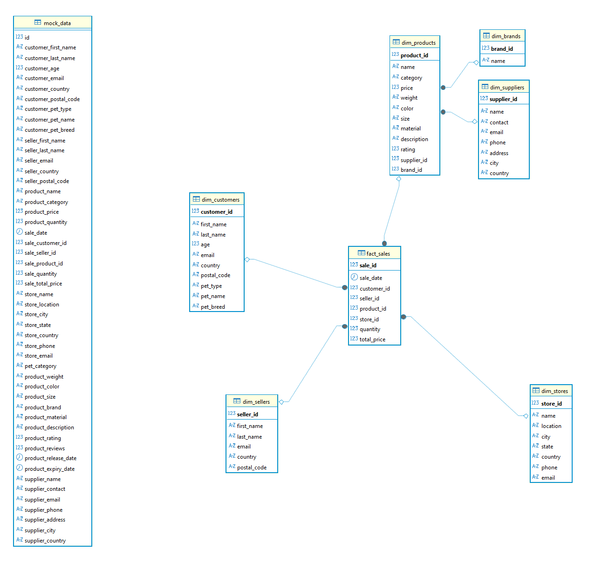
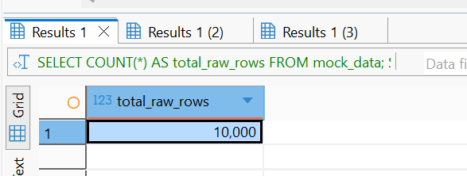
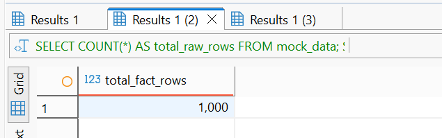
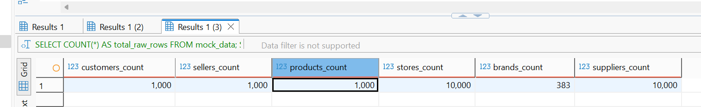

# Ход работы
В исходных данных вся информация о покупателях, продавцах, товарах, магазинах и поставщиках была свалена в одну широкую таблицу mock_data. Такая структура неудобна для аналитики: одни и те же значения многократно дублируются.

В результате нормализации была построена аналитическая модель в виде схемы «Снежинка». В центре находится таблица фактов fact_sales, содержащая только ключи на измерения и числовые показатели (количество и сумма продажи). Вокруг неё расположены измерения: dim_customers, dim_sellers, dim_stores, dim_products. Измерение продуктов дополнительно нормализовано на отдельные таблицы dim_brands и dim_suppliers.

По сравнению с плоской таблицей mock_data схема «Снежинка» уменьшает дублирование данных и ускоряет аналитические запросы за счёт более компактных таблиц измерений. 

# Результаты

