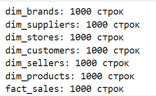
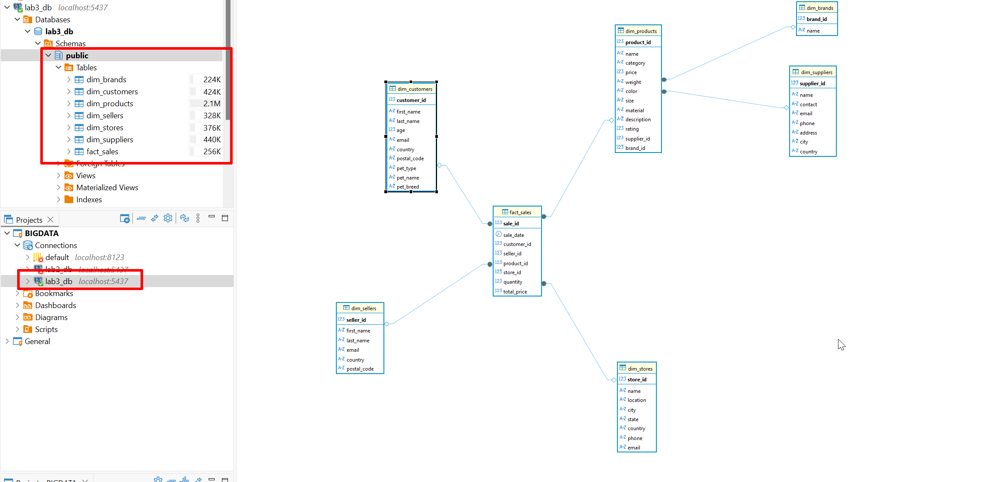

# BigDataFlink

В данной лабораторной реализован стриминговый пайплайн, который читает сырые данные о продажах из Apache Kafka и в реальном времени раскладывает их в модель «Снежинка» в PostgreSQL с помощью Apache Flink.

## Структура проекта

- docker-compose.yml - поднимает Kafka, PostgreSQL и Jupyter
    > Kafka работает в KRaft-режиме, поэтому отдельный контейнер c ZooKeeper не требуется: управление метаданными и роль контроллера выполняются самой Kafka
- 02_init.sql - скрипт инициализации PostgreSQL
- work/ - папка с Jupyter-ноутбуком, где написана логика Flink-джобов
- work/data/ - CSV-файлы с моковыми данными о продажах
- work/jars/ - JAR-файлы коннекторов Flink (Kafka, JDBC, PostgreSQL driver)

## Как запустить

1. Поднять контейнеры

```bash
docker-compose up -d
```
2. Открыть Jupyter Notebook

- Перейти в браузере на `http://localhost:8888`
- Открыть ноутбук `work/notebook.ipynb`

3. Запустить ячейки последовательно

    Шаг 1: Установка зависимостей

    Шаг 2: Создание Kafka-топика

    Шаг 3: Отправка данных в Kafka

    Шаг 4: Инициализация Flink

    Шаг 5: Создание Kafka-source

    Шаг 6: Создание JDBC-sink

    Шаг 7: Запуск Flink Streaming Job

    > Так как джоба работает в потоковом режиме, в ноутбуке она явно остановлена, это не ошибка, а прерывание работы после успешного завершения.

    Шаг 8: Проверка данных

    

## Нюансы при выполнении

- **NaN в CSV**: поля с пустыми значениями (например, seller_postal_code) pandas сериализует как NaN, что невалидно для JSON. Перед отправкой была произведена замена: `df = df.where(pd.notna(df), other=None)`.
- **Too many clients**: Flink открывает по одному JDBC-соединению на каждый синк. При повторных запусках незакрытые соединения могут исчерпать лимит PostgreSQL, что и случилось при выполнении лабораторной. Решение - был добавлен дополнительный параметр `'sink.parallelism' = '1'` в каждом синке.

# Результаты работы
Для наглядности в красных прямоугольниках обведено подключение к базе данных, для которой выведена схема в правом окне, и кол-во занимаемой памяти каждой таблицей.

